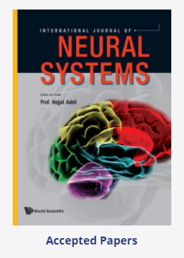
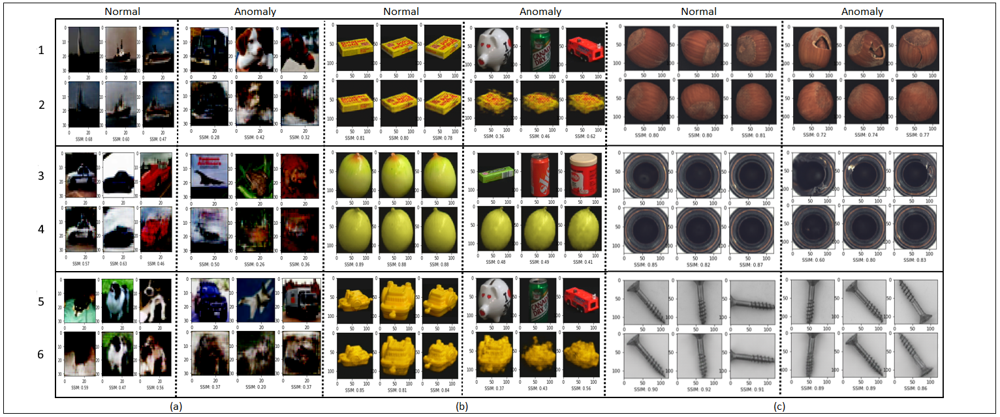
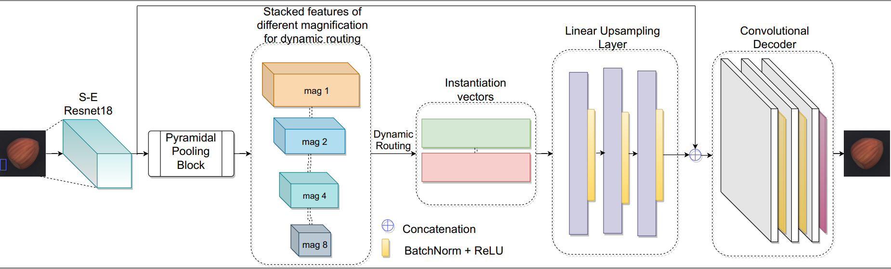
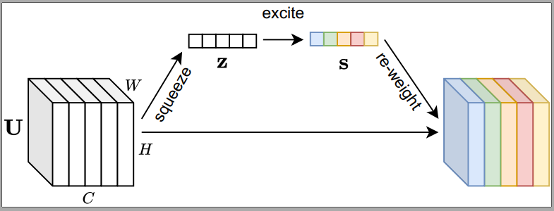
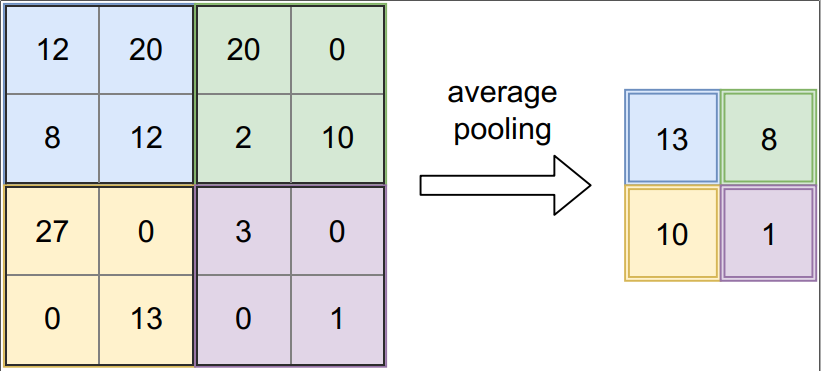

# [Pyramidal Image Anomaly Detector(PIADE)](https://doi.org/10.1142/S0129065720500604)
## A neural network for image anomaly detection with deep pyramidal reporesentations and dynamic routing
*Pankaj Mishra, Claudio Piciarelli, Gian Luca Foresti* [Link to paper](https://doi.org/10.1142/S0129065720500604)

**Abstract**—*Anomaly detection consists in identifying, within a dataset, those samples that significantly differ from the majority of the data, representing the normal class. It has many practical
applications, e.g. ranging from defective product detection in industrial systems to medical imaging. This paper focuses on image anomaly detection using a deep neural network with multiple
pyramid levels to analyze the image features at different scales. We propose a network based on encoding-decoding scheme, using a standard convolutional autoencoders, trained on normal data
only in order to build a model of normality. Anomalies can be detected by the inability of the network to reconstruct its input. Experimental results show a good accuracy on MNIST, FMNIST
and the recent MVTec Anomaly Detection dataset.*

# Results
we proposed a reconstruction-based, semi-supervised deep neural network for image anomaly detection. The network is trained on normal data only, and it builds a \normality model" by
mapping the input images in a low-dimension feature space, from which they can be correctly reconstructed. Experimental results showed that the proposed model is at least at-par,
and often outperforms other state-of-the-art works. Further ablation experiments prove the validity of the architectural choices on which the proposed network is based.

# PIADE Network Architecture

It consists of an initial ResNet block to extract basic image features. These features are then pooled in the pyramidal pooling block, in order to represent them at different scales. Following the idea of
capsule networks,7 the pooled features are then dynamically routed to two instantiation vectors (more details in paper), in order to filter the best ones that are useful for later image reconstruction. Image is
then reconstructed via a linear upsampling layer and a convolutional decoder in order to obtain an output with the same shape of the input data.

## Soft Attention (Squeeze- Exciation Block)
In order to improve the quality of the extracted features, each convolutional block is followed by a Squeeze-and-Excitation (SE) block, as proposed by Hu et al.

## Pyramidal Pooling Layer
The idea behind the pyramidal pooling layer is that image features can be analyzed at different magnifications, and possibly relevant features that are well-visible at a given
scale could be not well extracted by the network at another scale. The pyramidal pooling layer thus scales the input features at different magnification levels, thus increasing the possibility that features
relevant for the anomaly detection task are actually extracted (more detail in paper).

{ width=50% }

# Ablation Study
A set of ablation studies has been done, in which the network is re-trained after the removal of specific parts in order to measure the influence of those parts on the network performance.

# Reference to datasets-
**MvTech Dataset**- *P. Bergmann, S. L¨owe, M. Fauser, D. Sattlegger and C. Steger, Improving unsupervised defect segmentation by applying structural similarity to autoencoders, International joint conference on computer vision, imaging and computer graphics theory and applications, 2019.*

**COIL100 Dataset**- *S. A. Nene, S. K. Nayar and H. Murase, Columbia object image library (coil-100), Tech. Report Technical Report CUCS-006-96, Columbia University(1996)*

**CIFAR10 Dataset**- https://www.cs.toronto.edu/~kriz/cifar.html

**MNIST Dataset**- *Y. LeCun, L. Bottou, Y. Bengio, and P. Haffner. "Gradient-based learning applied to document recognition." Proceedings of the IEEE, 86(11):2278-2324, November 1998, Link:* http://yann.lecun.com/exdb/mnist/